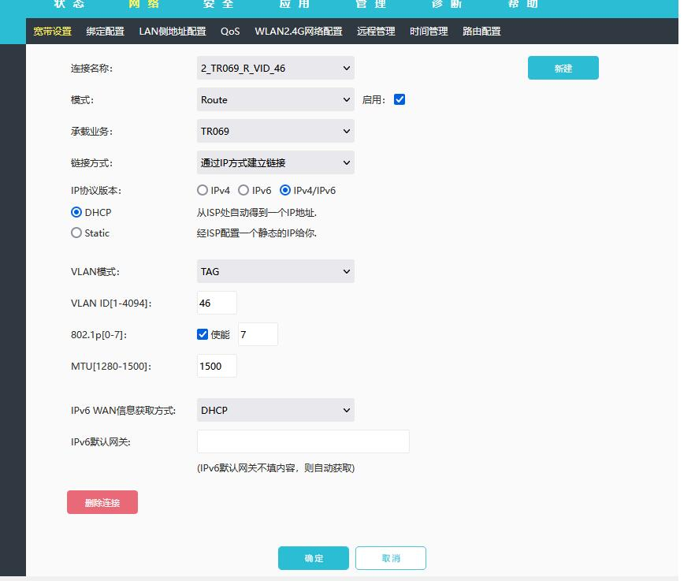
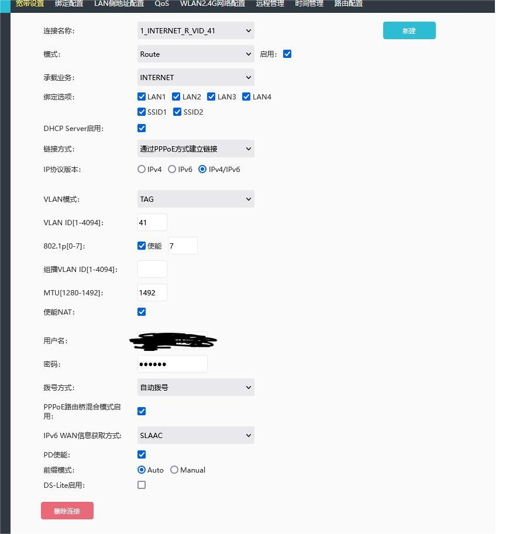

起因：
听说改桥接能获取外网固定IP<br >
结果：
获取到了 10.x.x.x开头的 IP :(
```bash
1. 开启路由tel （前提是你要先登录路由后面的user用户再访问此链接）
http://192.168.1.1/cgi-bin/getGateWay.cgi  访问第一次， 有个no, 再访问一下， 会变成yes

2.telnet
telnet 192.168.1.1
username: admin
password:s2@We3%Dc#

3.查看密码

# cat /tmp/ctromfile.cfg |grep CMCCA
        <Entry0 Active="Yes" username="CMCCAdmin" web_passwd="W5^cA1*v"
# 

4. 登录时手动输入密码，不要复制粘贴

5.关闭 tel服务
http://192.168.1.1/cgi-bin/byeBye.cgi


注意:
不小心删掉配置时， 手动写上:

```

